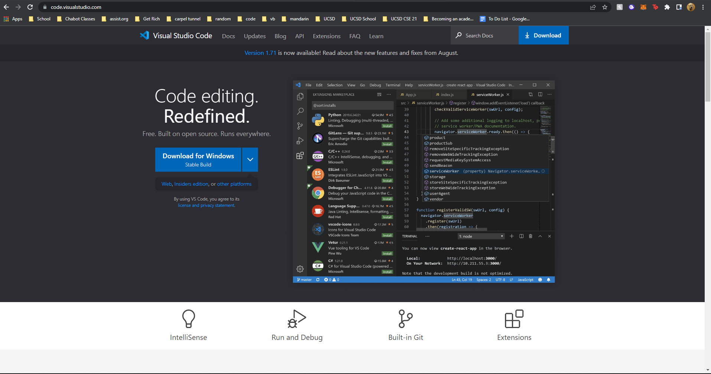
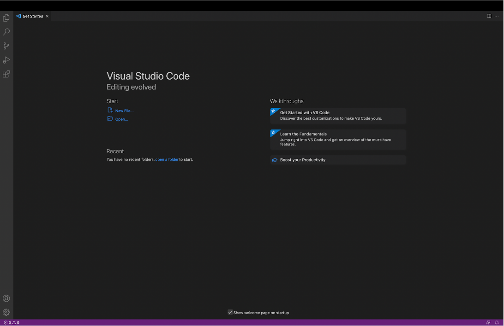
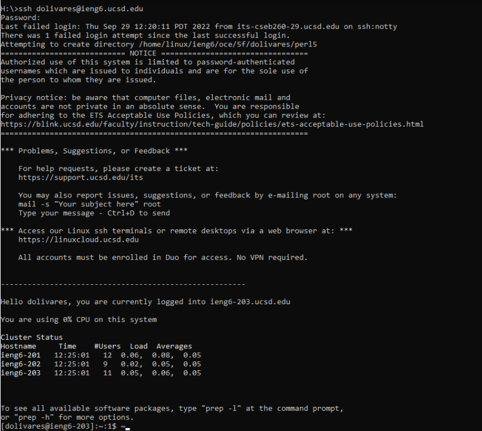
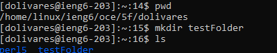
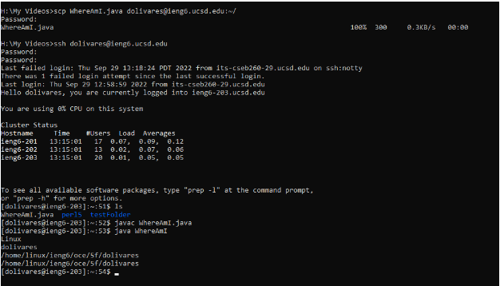
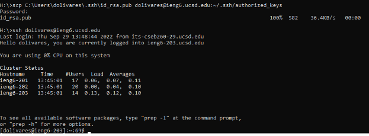

# Week 1 Lab Report

## Installing VScode

- I went to [https://code.visualstudio.com/](https://code.visualstudio.com/).
- I followed the instructions to download and install visual studio code once I opened the site.
- I waited for it to install, then launched the program to see the following screen when done.

## Remotely Connecting

- 
## Trying Some Commands

## Moving Files with scp

## Setting an SSH Key

## Optimizing Remote Running
czdxv