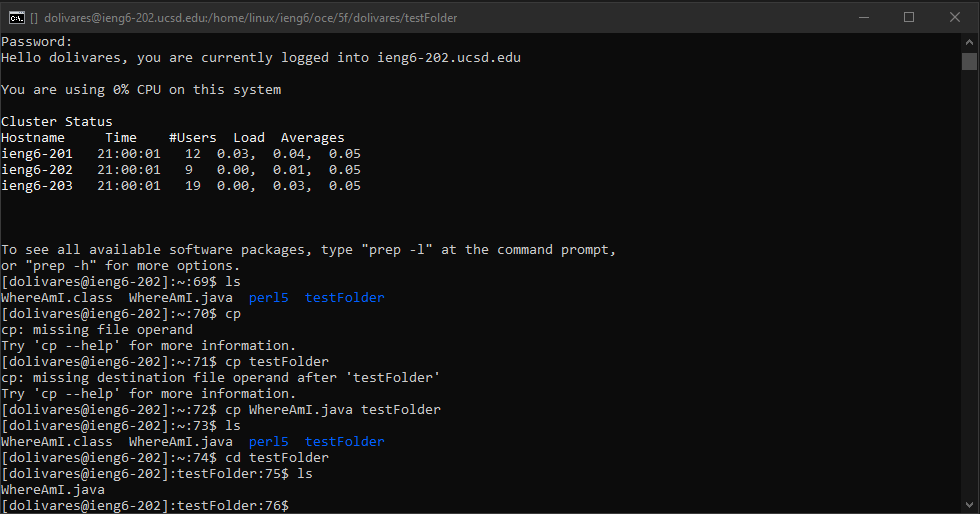
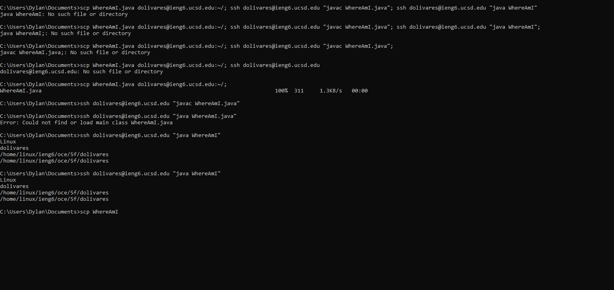

# Week 1 Lab Report

## Installing VScode

- I went to [https://code.visualstudio.com/](https://code.visualstudio.com/).
- I followed the instructions to download and install visual studio code once I opened the site.
- I waited for it to install, then launched the program to see the following screen when done.

## Remotely Connecting

- I started in the command prompt, and used the ssh command to connect to the remote host.
- When I connected, it asked me if I wanted to connect to the new server and said yes!
- I typed in my password, and was connected the server.

## Trying Some Commands

- When I was trying some commands I ran pwd, which display my current working directory.
- I used mkdir to create a new testFolder, and I used ls to show that the file was created in my current directory.

- Moreover, I used the cp command to copy the java file into the new folder I created, and ls to show that it was copied.

## Moving Files with scp

- I had the file WhereAmI.java on my current machine, and I wanted to used scp to get it over to the remote server. 
- I exited the remote server using command "exit", then I used the scp command to choose the file I wanted to copy over, and what username.
- I put in my password, logged back into the remote server, and checked using ls to see the files in my current directory.

## Setting an SSH Key

- I used the command "ssh-keygen" from my current machine, and let it save the key to the default file using no passphrase.
- I logged back into the server using ssh, and made a new directory .ssh.
- I went back to my current machine and scp the file location of the public key to the .ssh held within the remote server.

## Optimizing Remote Running

- I attempted to put everything into one line to be able to just use one up arrow and enter after the file was edited and saved.
- However, that did not work and I ended up splitting it into three commands
- Therefore, I would have to do up arrow and enter three times after editing and saving the file.