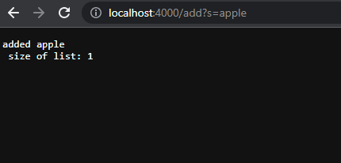
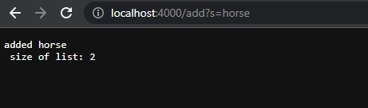
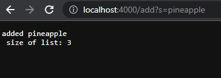
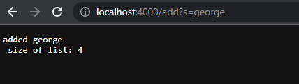
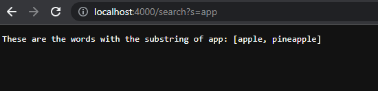
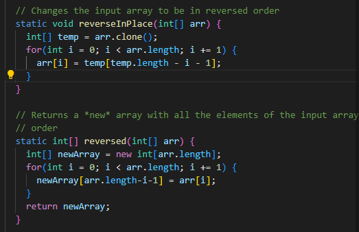
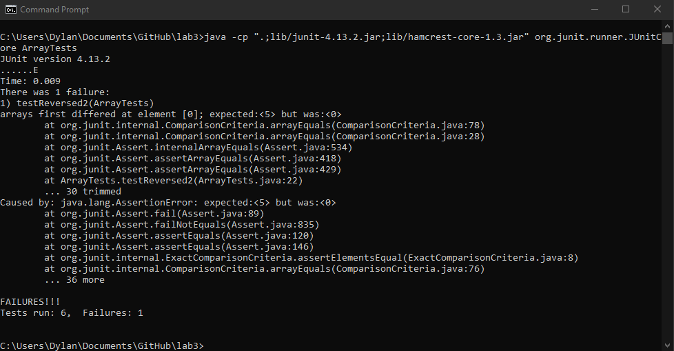
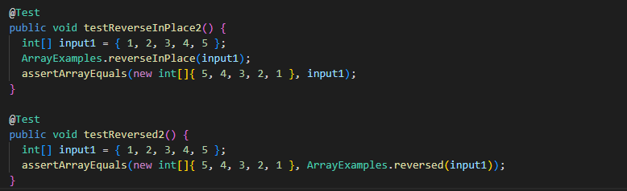
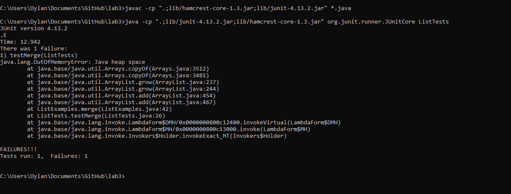

# Week 3 Lab Report

## Part 1
### SearchEngine.java
~~~
import java.io.IOException;
import java.net.URI;
import java.util.ArrayList;

class Handler implements URLHandler {
    int num = 0;
    ArrayList<String> list = new ArrayList<String>();

    public String handleRequest(URI url) {
            System.out.println("Path: " + url.getPath());
            if (url.getPath().contains("/add")) {
                String[] parameters = url.getQuery().split("=");
                if(parameters[0].equals("s")) {
                    list.add(parameters[1]);
                    return "added " + list.get(list.size()-1) + "\n size of list: " + list.size();
                }
            }
            else if(url.getPath().contains("/search")) {
                String[] parameters2 = url.getQuery().split("=");
                if(parameters2[0].equals("s")) {
                    String word = parameters2[1];
                    ArrayList<String> storeWords = new ArrayList<String>();
                    for(int j = 0; j < list.size(); j++) {
                            int nump = list.get(j).indexOf(word);
                            System.out.println(nump);
                            if(nump != -1) {
                                storeWords.add(list.get(j));
                                System.out.println("TRUE");
                            }
                    }
                    return "These are the words with the substring of " + parameters2[1] +": " + storeWords.toString();
                }
            }
            return "404 Not Found!";
    }
}

class SearchEngine {
    public static void main(String[] args) throws IOException {
        if(args.length == 0){
            System.out.println("Missing port number! Try any number between 1024 to 49151");
            return;
        }

        int port = Integer.parseInt(args[0]);

        Server.start(port, new Handler());
    }
}
~~~
### Server.java
~~~
import java.io.IOException;
import java.io.OutputStream;
import java.net.InetSocketAddress;
import java.net.URI;

import com.sun.net.httpserver.HttpExchange;
import com.sun.net.httpserver.HttpHandler;
import com.sun.net.httpserver.HttpServer;

interface URLHandler {
    String handleRequest(URI url);
}

class ServerHttpHandler implements HttpHandler {
    URLHandler handler;
    ServerHttpHandler(URLHandler handler) {
      this.handler = handler;
    }
    public void handle(final HttpExchange exchange) throws IOException {
        // form return body after being handled by program
        try {
            String ret = handler.handleRequest(exchange.getRequestURI());
            // form the return string and write it on the browser
            exchange.sendResponseHeaders(200, ret.getBytes().length);
            OutputStream os = exchange.getResponseBody();
            os.write(ret.getBytes());
            os.close();
        } catch(Exception e) {
            String response = e.toString();
            exchange.sendResponseHeaders(500, response.getBytes().length);
            OutputStream os = exchange.getResponseBody();
            os.write(response.getBytes());
            os.close();
        }
    }
}

public class Server {
    public static void start(int port, URLHandler handler) throws IOException {
        HttpServer server = HttpServer.create(new InetSocketAddress(port), 0);

        //create request entrypoint
        server.createContext("/", new ServerHttpHandler(handler));

        //start the server
        server.start();
        System.out.println("Server Started! Visit http://localhost:" + port + " to visit.");
    }
}
~~~

- The methods that are called in my code are /add and /search.
- The relevant arguments to those methods are, and the values that go into the query /add is adding those strings inputted to a list, and /search is using the input to search if it is a substring of any of the words in the list.
- The elements inside of the list change everytime the user uses the /add method to add a string to the list. 

## Part 2

- The failure-inducing input for static int[]reversed(int[] arr) was an array that was {1,2,3,4,5}.
- The symptom was that the code was expecting 5 for the first element, but got 0.
- The bug was that the method was not adding new elements to the array it created, but it was trying to flip itself around.
- The bug causes that particular symptom for that particular input because of the way the the array was modifying itself and not the new array created. 

