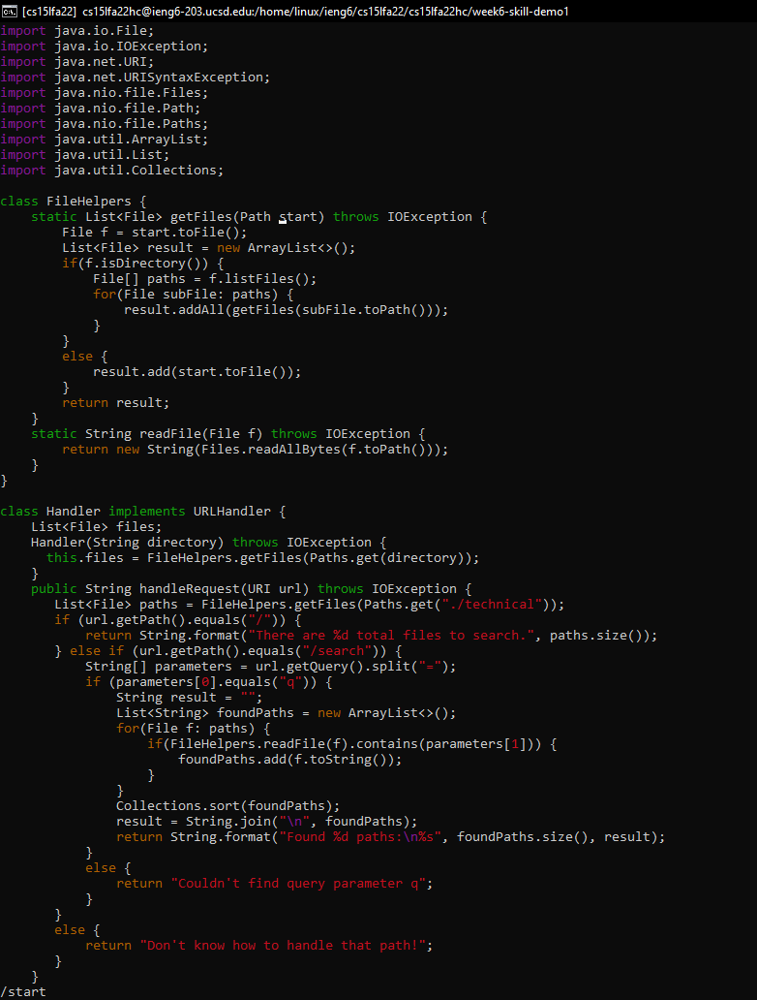
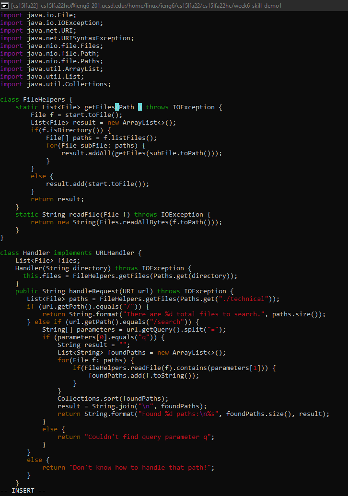
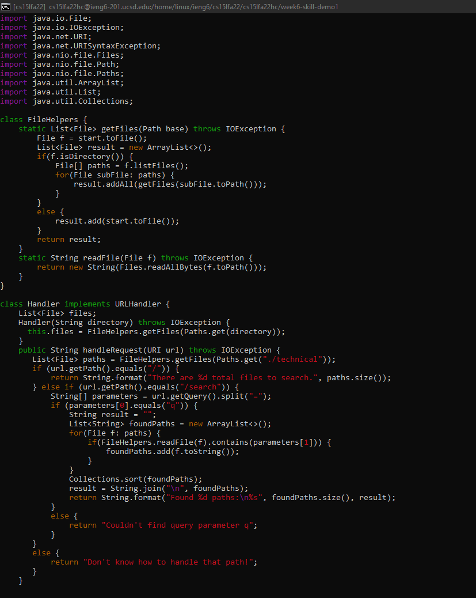
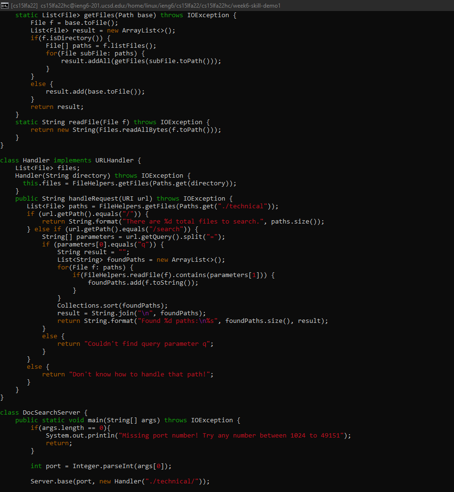
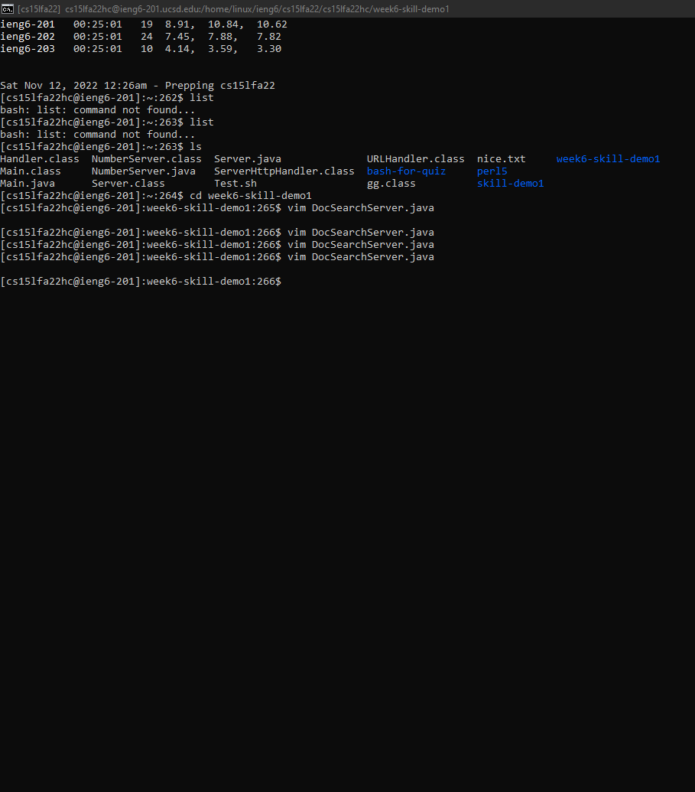

# Week 7 Lab Report 4
## Part 1
### In DocSearchServer.java, change the name of the start parameter of getFiles, and all of its uses, to instead be called base.
```
'/start <Enter> cebase <Esc> n.n.n. :wq <Enter>
```

Keys Pressed
```
/start <Enter>
```
- /start will highlight the first occurence and once you hit enter it will go to that first occurence in the file.

Keys Pressed
```
ce
```
- ce deletes the word and puts the user into insert mode.

Keys Pressed
```
base
```
- After being in insert mode, now we type "base" to replace the word we deleted.

Keys Pressed
```
n.n.n.
```
- "n" will redo the search and go down to the next instance found. The "." will insert the last inserted text again. Thus, "n.n.n." will change the rest of the instances of start and replace them with "base".

Keys Pressed
```
:wq <Enter>
```
- ":wq" and enter will save and exit the file!
## Part 2
<p>It took me 84 seconds to make the edits in Visual Studio Code, scp the file to the remote server, log onto the remote server, and run test.sh.
It took me 57 seconds to make the edits using vim, and then testing if it worked by running test.sh.
</p>
<p>Of the two styles, I prefer using vim if I had to work on a program that I was running remotely. Vim just provides a much quicker, and efficient way to edit and grow through the file without having to scp after every change you want to see made.
</p> 
<p>A factor in my decision would be if I was not super familiar with the language, then I would probably use Visual Studio Code and scp, so that I have that option of my text editor helping me with syntax. Another factor could be how many files I am changing because having to scp a lot of different files may get tedious.
</p>

