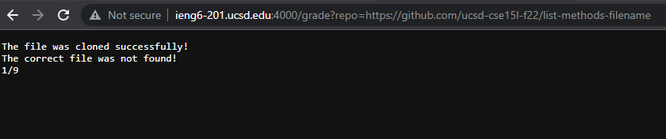
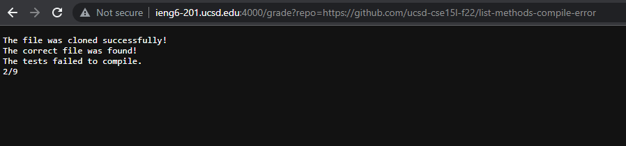
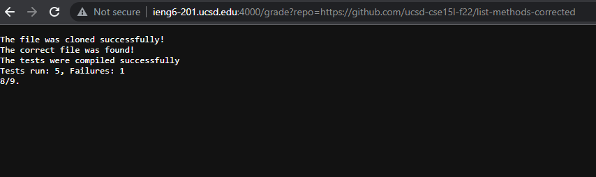

# Week 8 Lab Report 5
```
rm -rf student-submission
git clone $1 student-submission

if [[ $? -eq 0 ]]
then
    echo "The file was cloned successfully!"
else
    echo "The file has failed to be cloned!"
    echo "0/9"
    exit 1
fi
cp -r lib student-submission
cp TestListExamples.java student-submission
cd student-submission

if [[ -f "ListExamples.java" ]]
then
    echo "The correct file was found!"
else
    echo "The correct file was not found!"
    echo "1/9"
    exit 1
fi
#javac -cp ".;./lib/hamcrest-core-1.3.jar;./lib/junit-4.13.2.jar" *.java 2> error.txt
javac -cp .:lib/hamcrest-core-1.3.jar:lib/junit-4.13.2.jar *.java 2> error.txt
if [[ $? -eq 0 ]]
then
    echo "The tests were compiled successfully"
else
    echo "The tests failed to compile."
    echo "2/9"
    exit 1
fi

#java -cp ".;./lib/hamcrest-core-1.3.jar;./lib/junit-4.13.2.jar" org.junit.runner.JUnitCore TestListExamples > results.txt
java -cp .:lib/hamcrest-core-1.3.jar:lib/junit-4.13.2.jar org.junit.runner.JUnitCore TestListExamples > results.txt
grep -q "OK" results.txt

if [[ $? -eq 0 ]]
then
    echo "9/9"
    exit 0 
else
    score=$(grep -o 'Failures: [1-5]' results.txt | grep -Eo '[1-5]+')
    failed=`cat results.txt | grep "Tests run:"`
    echo $failed
    let "score = 9 - score"
    echo "$score/9."
    exit 1
fi
```


-"rm -rf student-submission" is supposed to remove the insides of any previous file that already has this directory name!
-



